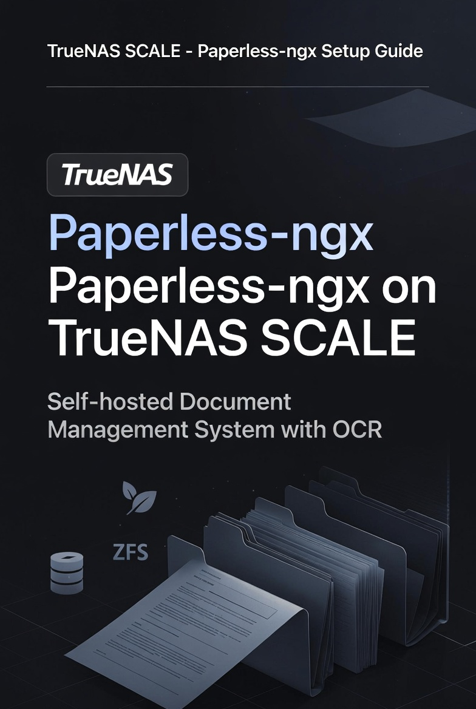

# Paperless-ngx on TrueNAS SCALE

  

**Complete, reproducible guide** for installing and configuring **Paperless-ngx** on TrueNAS SCALE with proper ZFS datasets, Gmail ingestion, and tax/document workflow.

---

## ✨ Features

- Full ZFS dataset structure with snapshots
- Gmail IMAP ingestion for automatic document import
- OCR + intelligent tagging
- Dedicated storage paths for media, consume, and trash
- Tax return workflow (2010–present)

---

## 🚀 Quick Start

1. Create recommended ZFS datasets
2. Install Paperless-ngx from TrueNAS Apps
3. Map storage volumes correctly
4. Configure Gmail IMAP
5. Set up Document Types & Storage Paths

**Total time**: ~20–30 minutes

---

## 📖 Full Documentation

| Document | Description |
|----------|-------------|
| **[SETUP-GUIDE.md](SETUP-GUIDE.md)** | Complete step-by-step installation |
| **[docs/best-practices.md](docs/best-practices.md)** | Naming conventions & tax workflow |
| **[docs/troubleshooting.md](docs/troubleshooting.md)** | Common issues and fixes |

---

## 📸 Screenshots

**ZFS Dataset Structure**  

**Storage Configuration**  

**Dashboard**  

---

## 🛠️ Prerequisites

- TrueNAS SCALE 24.10 or newer
- Dedicated storage pool with sufficient space
- Gmail account with **App Password** enabled

---

## 📝 Best Practices

See **[docs/best-practices.md](docs/best-practices.md)** for:
- Recommended document naming
- Tax return organization strategy
- Retention & cleanup rules

---

## 🤝 Contributing

Issues and improvements are welcome!

---

## 📄 License

[MIT License](LICENSE) © 2026 Duc Nguyen

---

**Star this repo if it helped you go paperless!** 📄

_Last updated: May 2026_