# Paperless-ngx on TrueNAS SCALE - Complete Setup Guide

## 1. Create ZFS Datasets (Recommended Structure)

Create a parent dataset and the following child datasets:

- DataPool/apps/paperless-ngx (parent)
- DataPool/apps/paperless-ngx/consume
- DataPool/apps/paperless-ngx/media
- DataPool/apps/paperless-ngx/data
- DataPool/apps/paperless-ngx/postgres-data
- DataPool/apps/paperless-ngx/trash

**Screenshot:**  
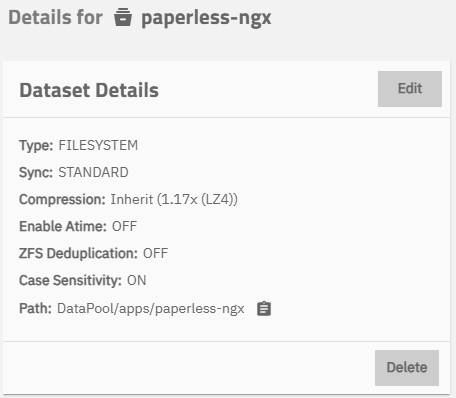

**Screenshot:**  
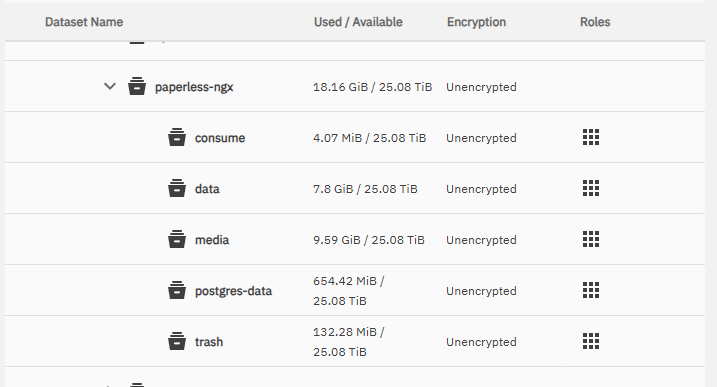

## 2. Install Paperless-ngx App

Go to **Apps** → **Paperless-ngx** → Install.

### Storage Configuration

Configure each storage volume as shown:

- **Data Storage**: /mnt/DataPool/apps/paperless-ngx/data
- **Media Storage**: /mnt/DataPool/apps/paperless-ngx/media
- **Consume Storage**: /mnt/DataPool/apps/paperless-ngx/consume
- **Trash Storage**: /mnt/DataPool/apps/paperless-ngx/trash
- **Postgres Data**: /mnt/DataPool/apps/paperless-ngx/postgres-data

**Screenshots:**

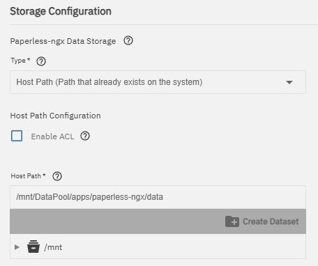  
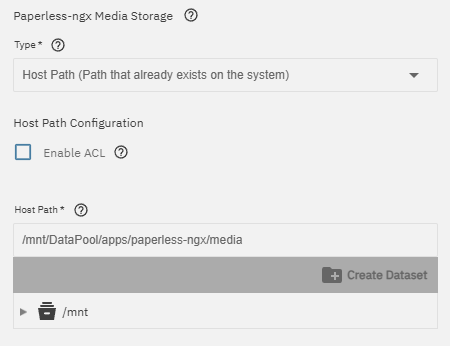  
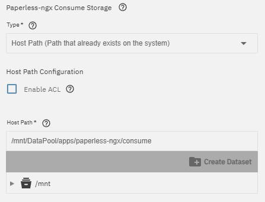  
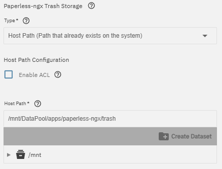  
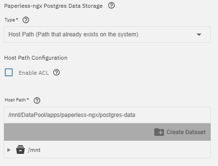

## 3. Initial Configuration in Paperless-ngx

### Create Storage Paths
Go to **Manage** → **Storage Paths** → Create

**Screenshot:**  
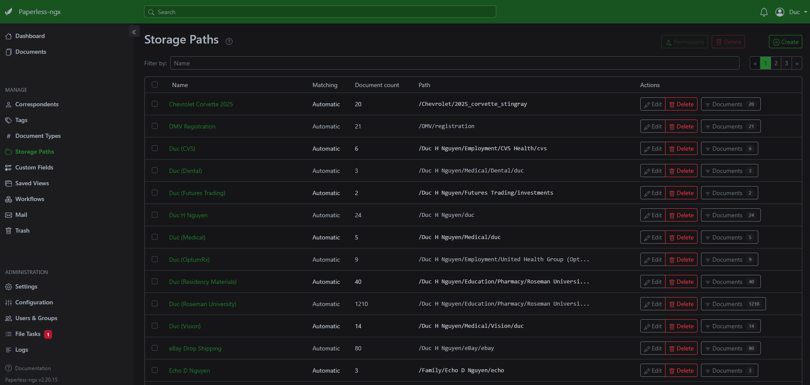

### Create Document Types
Go to **Manage** → **Document Types** → Create

**Screenshot:**  
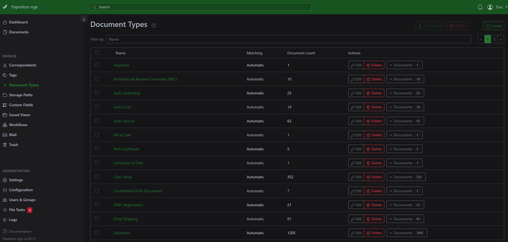

### Configure Gmail for Email Ingestion
Go to **Manage** → **Mail** → Add Account

**Screenshot:**  
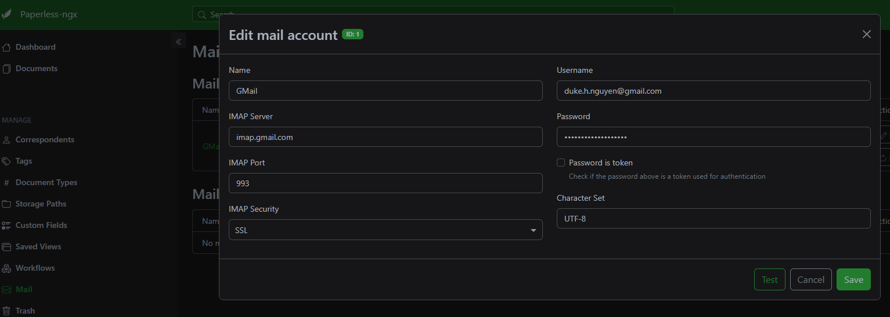

**Settings used:**
- IMAP Server: imap.gmail.com
- IMAP Port: 993
- IMAP Security: SSL

## 4. Dashboard After Setup

**Screenshot:**  
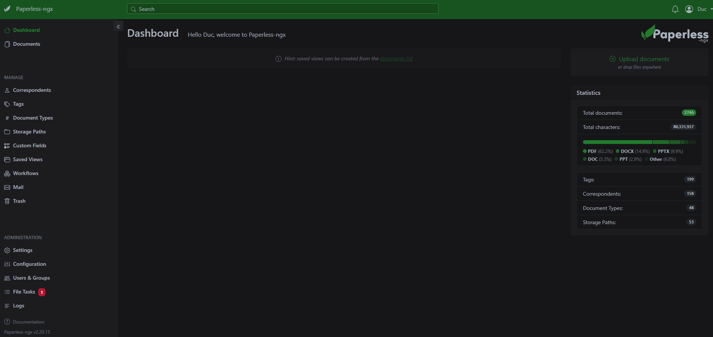

## 5. First Document Workflow (Tax Returns)

See detailed workflow in the next sections.
